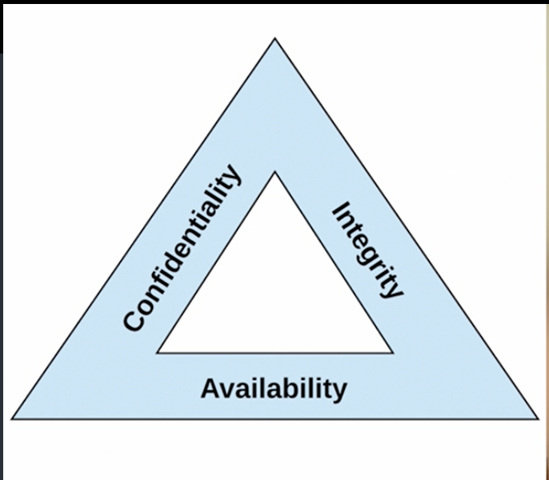

# ⚖️ CIA Triad: The Three Pillars of Cybersecurity

**CIA stands for Confidentiality, Integrity, and Availability**, which are the three core principles of cybersecurity:

- **🔏 Confidentiality** – Ensures that data is accessible only to authorized users and protects it from unauthorized access.
- **🛡️ Integrity** – Ensures the accuracy and reliability of data by preventing unauthorized modifications.
- **⚡ Availability** – Ensures that systems, networks, and data are accessible and operational when needed.

## 🚨 Confidentiality Threats & Solutions

- **🔍 Snooping** – Unauthorized access to someone’s data, files, or communications, often by an insider or hacker looking for sensitive information.  
  💡 **Example:** An employee accesses confidential client data without permission to sell it to a competitor.  
  ✅ **Solution:** **Use encryption** for data at rest and in transit to prevent unauthorized access. Also, clean your work desk before leaving.

- **🗑️ Dumpster Diving** – Searching through trash or discarded materials to find confidential information like passwords, financial records, or company data.  
  💡 **Example:** A hacker finds old bank statements and password lists in the company's dumpster and uses them for identity theft.  
  ✅ **Solution:** **Shred documents** before disposal and implement secure disposal methods for sensitive materials.

- **🎧 Eavesdropping** – Secretly listening to private conversations, either in-person or through electronic means, to gather sensitive information.  
  💡 **Example:** A cybercriminal intercepts a conversation over an unsecured Wi-Fi network to steal login credentials.  
  ✅ **Solution:** Use **end-to-end encryption** for communications and avoid discussing sensitive information in public or over unsecured channels.

- **📞 Wiretapping** – Intercepting and monitoring telephone or network communications to capture conversations or data, often illegally.  
  💡 **Example:** An attacker listens to phone conversations between a CEO and an investor to steal confidential business plans.  
  ✅ **Solution:** Implement **network encryption (e.g., VPN, TLS)** and regularly monitor for unauthorized network taps.

- **🎭 Social Engineering** – Manipulating people into revealing confidential information or performing actions that compromise security, often through deception or psychological tactics.  
  💡 **Example:** A hacker impersonates an IT technician and tricks an employee into revealing their password via email.  
  ✅ **Solution:** Conduct **security awareness training** to educate employees on recognizing and resisting manipulation tactics.

## 🔐 Integrity Concerns & Solutions

- **❌ Unauthorized Modification** – Illegitimate changes to data that compromise its accuracy and reliability.  
  💡 **Example:** A hacker alters transaction records in a bank's database to steal funds while disguising the fraudulent activity.  
  ✅ **Solution:** Implement **access controls**, use **hashing (SHA-256, MD5)**, and enable **version control** to track changes.

- **🕵️‍♂️ Impersonation** – An attacker pretends to be a legitimate user to manipulate or alter data.  
  💡 **Example:** An attacker steals login credentials to impersonate a system administrator and changes user permissions to gain unauthorized access.  
  ✅ **Solution:** Use **multi-factor authentication (MFA)**, enforce **strong password policies**, and monitor for suspicious login attempts.

- **🖥️ Man-in-the-Middle (MITM) Attack** – An attacker intercepts and potentially alters communication between two parties.  
  💡 **Example:** A hacker intercepts login credentials between a user and a website by exploiting an unsecured Wi-Fi network.  
  ✅ **Solution:** Use **end-to-end encryption (TLS, HTTPS)**, enforce **certificate pinning**, and implement **secure network protocols**.

- **🔁 Replay Attack** – An attacker captures and reuses valid data transmission (e.g., login requests) to gain unauthorized access.  
  💡 **Example:** An attacker captures a user’s login session and replays it later to access the user’s account without their permission.  
  ✅ **Solution:** Implement **timestamps**, use **one-time tokens (OTPs)**, and enforce **session expiration policies**.

## 🚨 Availability Threats & Solutions

- **💻 DOS (Denial of Service)** – An attack that prevents legitimate users from accessing a system or service by overwhelming it with traffic.  
  💡 **Example:** A DDoS attack floods a website with traffic, causing it to crash and making it unavailable for users.  
  ✅ **Solution:** Use **rate limiting**, implement **firewalls**, and set up **intrusion detection systems (IDS)** to detect and block malicious traffic.

- **🖥️ Hardware Failure** – Physical failure of a device or component, such as a hard drive, server, or network equipment, causing downtime.  
  💡 **Example:** A hard drive failure causes a database to become inaccessible, disrupting services.  
  ✅ **Solution:** Implement **regular backups**, use **redundant hardware** (e.g., RAID configurations), and ensure **disaster recovery** plans are in place.

- **⚡ Power Outage** – Loss of electrical power, leading to system shutdowns and service interruptions.  
  💡 **Example:** A power outage at a data center causes servers to go offline, making critical systems unavailable.  
  ✅ **Solution:** Use **uninterruptible power supplies (UPS)**, set up **backup generators**, and have **regular power failure drills** for contingency planning.

- **💥 Destruction** – Physical damage to infrastructure, such as fire, floods, or earthquakes, leading to data loss or service disruption.  
  💡 **Example:** A fire at a data center destroys servers, causing a total loss of critical data and services.  
  ✅ **Solution:** Implement **offsite backups**, use **cloud storage**, and ensure **disaster recovery plans** are in place to minimize impact.

- **🌐 Service Outages** – Interruption of service due to issues with the service provider or internal system failures.  
  💡 **Example:** A cloud service provider experiences a network failure, causing users to lose access to critical applications.  
  ✅ **Solution:** Use **multi-cloud providers**, implement **failover systems**, and ensure **service level agreements (SLAs)** are in place with providers.
