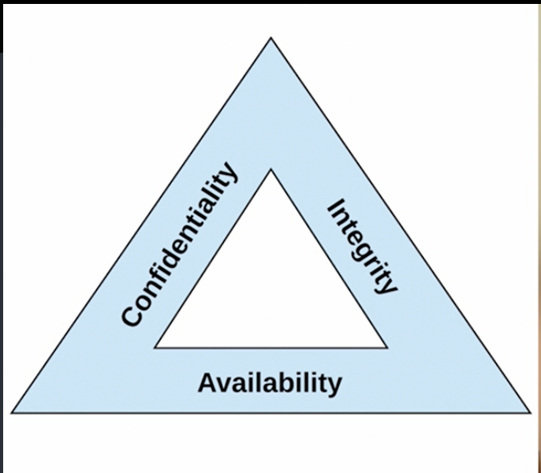
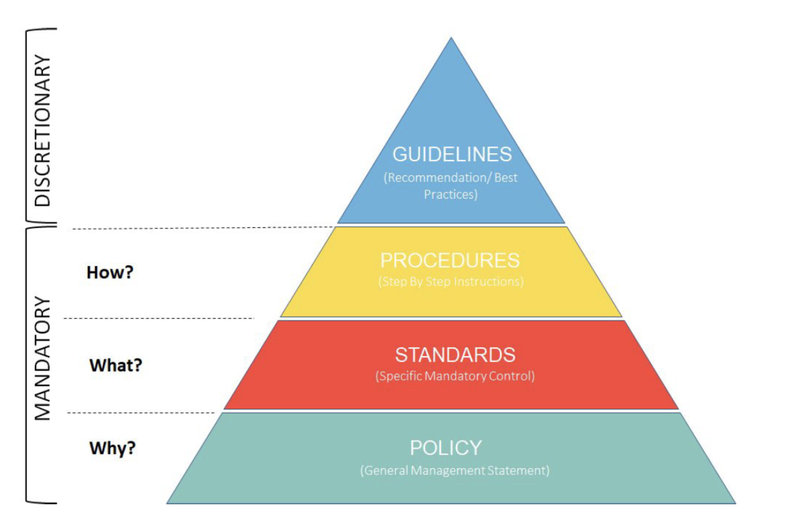

> **Note: 🎯 Key Insights for Success - (ISC)² CC Exam Cheatsheet**  
> This cheatsheet provides a collection of essential tips, strategies, and key concepts designed to guide you through the (ISC)² Certified in Cybersecurity (CC) exam. By following these helpful pointers, you can enhance your preparation and increase your chances of success.

# 📖 Table of Contents

- [🔐 (ISC)²: Overview and Ethical Code in Cybersecurity](#-isc-overview--ethical-code-in-cybersecurity)
- [⚖️ CIA Triad: The Three Pillars of Cybersecurity](#️-cia-triad-the-three-pillars-of-cybersecurity)
- [🛡️ Security Fundamentals: Access Control, Authentication, Privacy, and Password Management](#️-security-fundamentals-access-control-authentication-privacy-and-password-management)
- [⚠️ Risk Analysis and Management](#️-risk-analysis-and-management)
- [📜 Security Governance and Legal Regulations](#-security-governance-and-legal-regulations)

# 🔐 (ISC)²: Overview and Ethical Code in Cybersecurity

**🔍 What is (ISC)²?**

(ISC)² (**International Information System Security Certification Consortium**) is a non-profit organization that provides cybersecurity certifications and professional development resources. It is best known for its **Certified Information Systems Security Professional (CISSP)** certification, along with other certifications like **CC, SSCP, CCSP, CSSLP, CISSP-ISSAP, CISSP-ISSEP, and CISSP-ISSMP**. (ISC)² focuses on improving cybersecurity standards and promoting ethical practices in the field.

**⚖️ Code of Ethics Canons (Priority Order)**

1️⃣ **Protect society**, the common good, necessary public trust, and confidence.  
2️⃣ **Act honorably**, honestly, justly, responsibly, and legally.  
3️⃣ **Provide diligent and competent service** to principals (clients, employers, or organizations).  
4️⃣ **Advance and protect the profession**.

# ⚖️ CIA Triad: The Three Pillars of Cybersecurity

**CIA stands for Confidentiality, Integrity, and Availability**, which are the three core principles of cybersecurity:

- **🔏 Confidentiality** – Ensures that data is accessible only to authorized users and protects it from unauthorized access.
- **🛡️ Integrity** – Ensures the accuracy and reliability of data by preventing unauthorized modifications.
- **⚡ Availability** – Ensures that systems, networks, and data are accessible and operational when needed.

## 🚨 Confidentiality Threats & Solutions

- **🔍 Snooping** – Unauthorized access to someone’s data, files, or communications, often by an insider or hacker looking for sensitive information.  
  💡 **Example:** An employee accesses confidential client data without permission to sell it to a competitor.  
  ✅ **Solution:** **Use encryption** for data at rest and in transit to prevent unauthorized access. Also, clean your work desk before leaving.

- **🗑️ Dumpster Diving** – Searching through trash or discarded materials to find confidential information like passwords, financial records, or company data.  
  💡 **Example:** A hacker finds old bank statements and password lists in the company's dumpster and uses them for identity theft.  
  ✅ **Solution:** **Shred documents** before disposal and implement secure disposal methods for sensitive materials.

- **🎧 Eavesdropping** – Secretly listening to private conversations, either in-person or through electronic means, to gather sensitive information.  
  💡 **Example:** A cybercriminal intercepts a conversation over an unsecured Wi-Fi network to steal login credentials.  
  ✅ **Solution:** Use **end-to-end encryption** for communications and avoid discussing sensitive information in public or over unsecured channels.

- **📞 Wiretapping** – Intercepting and monitoring telephone or network communications to capture conversations or data, often illegally.  
  💡 **Example:** An attacker listens to phone conversations between a CEO and an investor to steal confidential business plans.  
  ✅ **Solution:** Implement **network encryption (e.g., VPN, TLS)** and regularly monitor for unauthorized network taps.

- **🎭 Social Engineering** – Manipulating people into revealing confidential information or performing actions that compromise security, often through deception or psychological tactics.  
  💡 **Example:** A hacker impersonates an IT technician and tricks an employee into revealing their password via email.  
  ✅ **Solution:** Conduct **security awareness training** to educate employees on recognizing and resisting manipulation tactics.

## 🔐 Integrity Concerns & Solutions

- **❌ Unauthorized Modification** – Illegitimate changes to data that compromise its accuracy and reliability.  
  💡 **Example:** A hacker alters transaction records in a bank's database to steal funds while disguising the fraudulent activity.  
  ✅ **Solution:** Implement **access controls**, use **hashing (SHA-256, MD5)**, and enable **version control** to track changes.

- **🕵️‍♂️ Impersonation** – An attacker pretends to be a legitimate user to manipulate or alter data.  
  💡 **Example:** An attacker steals login credentials to impersonate a system administrator and changes user permissions to gain unauthorized access.  
  ✅ **Solution:** Use **multi-factor authentication (MFA)**, enforce **strong password policies**, and monitor for suspicious login attempts.

- **🖥️ Man-in-the-Middle (MITM) Attack** – An attacker intercepts and potentially alters communication between two parties.  
  💡 **Example:** A hacker intercepts login credentials between a user and a website by exploiting an unsecured Wi-Fi network.  
  ✅ **Solution:** Use **end-to-end encryption (TLS, HTTPS)**, enforce **certificate pinning**, and implement **secure network protocols**.

- **🔁 Replay Attack** – An attacker captures and reuses valid data transmission (e.g., login requests) to gain unauthorized access.  
  💡 **Example:** An attacker captures a user’s login session and replays it later to access the user’s account without their permission.  
  ✅ **Solution:** Implement **timestamps**, use **one-time tokens (OTPs)**, and enforce **session expiration policies**.

## 🚨 Availability Threats & Solutions

- **💻 DOS (Denial of Service)** – An attack that prevents legitimate users from accessing a system or service by overwhelming it with traffic.  
  💡 **Example:** A DDoS attack floods a website with traffic, causing it to crash and making it unavailable for users.  
  ✅ **Solution:** Use **rate limiting**, implement **firewalls**, and set up **intrusion detection systems (IDS)** to detect and block malicious traffic.

- **🖥️ Hardware Failure** – Physical failure of a device or component, such as a hard drive, server, or network equipment, causing downtime.  
  💡 **Example:** A hard drive failure causes a database to become inaccessible, disrupting services.  
  ✅ **Solution:** Implement **regular backups**, use **redundant hardware** (e.g., RAID configurations), and ensure **disaster recovery** plans are in place.

- **⚡ Power Outage** – Loss of electrical power, leading to system shutdowns and service interruptions.  
  💡 **Example:** A power outage at a data center causes servers to go offline, making critical systems unavailable.  
  ✅ **Solution:** Use **uninterruptible power supplies (UPS)**, set up **backup generators**, and have **regular power failure drills** for contingency planning.

- **💥 Destruction** – Physical damage to infrastructure, such as fire, floods, or earthquakes, leading to data loss or service disruption.  
  💡 **Example:** A fire at a data center destroys servers, causing a total loss of critical data and services.  
  ✅ **Solution:** Implement **offsite backups**, use **cloud storage**, and ensure **disaster recovery plans** are in place to minimize impact.

- **🌐 Service Outages** – Interruption of service due to issues with the service provider or internal system failures.  
  💡 **Example:** A cloud service provider experiences a network failure, causing users to lose access to critical applications.  
  ✅ **Solution:** Use **multi-cloud providers**, implement **failover systems**, and ensure **service level agreements (SLAs)** are in place with providers.

# 🛡️ Security Fundamentals: Access Control, Authentication, Privacy, and Password Management

## Identification, Authentication, and Authorization

In the context of cybersecurity, **Identification**, **Authentication**, and **Authorization** are crucial concepts to ensure secure access to systems and data. Below is the explanation of each concept, along with both physical world and tech world scenarios for better understanding.

### 1. Identification 🆔

Identification is the process of claiming an identity. It is the first step in an access control system, where a user presents a credential (e.g., username, ID number) to prove who they are.

**💡 Example in the Physical World:**

Imagine you're going to a bank. The first thing the bank teller asks is for your **ID card**. You present your ID to **identify** yourself as a customer of the bank.

**🤖 Example in the Tech World:**

When you log into a website or an application, you are asked to provide your **username** or **email address**. This is the **identification** process where the system is trying to identify you as a user in its database. This could also be the case when you use **biometric scanners** on your phone to identify yourself by face or fingerprint.

### 2. Authentication 🔑

Authentication is the process of verifying that the identity claimed during the identification process is valid. This can involve something the user knows (password), something they have (token, smartphone), or something they are (biometric data).

**💡 Example in the Physical World:**

After presenting your **ID card** (identification), the bank teller asks you to **enter your PIN** or **provide a signature**. This is the **authentication** process where the bank ensures that you are the rightful owner of the account.

**🤖 Example in the Tech World:**

In the tech world, after providing your **username**, the system will prompt you for your **password**. This process ensures that the person trying to log in is the legitimate user. If two-factor authentication (2FA) is enabled, you may be required to enter a **one-time code** sent to your phone or email, adding an extra layer of **authentication**.

### 3. Authorization 🛂

Authorization is the process of granting or denying access to a system or resource based on the authenticated identity. It determines what actions a user can perform on the system, such as read, write, or delete data.

**💡 Example in the Physical World:**

After you are authenticated (with your **PIN** or **signature** at the bank), the bank teller will check your **account type** and grant you the appropriate access. For example, if you have a **savings account**, you might be authorized to withdraw money, but if you have a **checking account**, you might also be able to write checks. This is where the bank determines your **authorization** to perform specific actions based on your account type.

**🤖 Example in the Tech World:**

In a web application, once you’ve successfully logged in (authenticated), your account type (admin, user, guest, etc.) is checked to determine what actions you're allowed to perform. For example, a **regular user** may only be able to view data, while an **admin user** has permission to update or delete records. Access control lists (ACLs) or role-based access control (RBAC) are used to manage **authorization** in systems.

## 🛡️ Password Security

### 🔑 **Password Policy Controls**

When setting a password policy for your organization, consider the following technical controls to enhance security:

#### 1. **Password Length** 📏

- **Minimum character length** (recommended: at least **8 characters**).
- Longer passwords are more secure and harder to guess.

#### 2. **Password Complexity** 🔠

- Require different **character types**:
  - **Uppercase** and **lowercase letters**
  - **Digits**
  - **Special characters** (e.g., @, #, $, etc.)
- More character types = stronger password

#### 3. **Password Expiration** ⏳

- Force users to change passwords periodically (e.g., every **180 days**).
- Some organizations no longer enforce expiration and allow passwords to stay unless compromised.

#### 4. **Password History** 🕒

- Prevent users from **reusing old passwords**.
- Configure systems to remember previous passwords and block reuse.

#### 5. **Password Reset Process** 🔄

- Ensure a **quick and secure password change process** for users.
- Avoid weak reset mechanisms that could allow unauthorized access.

### 🔐 **Password Management Best Practices**

#### 6. **Avoid Password Reuse** 🔄

- **Discourage password reuse** across multiple sites.
- If a site is compromised, reused passwords could allow attackers to access other accounts.

#### 7. **Use Password Managers** 🧳

- **Password managers** securely store and create **unique passwords** for each site.
- Protect password managers with **biometric security** mechanisms (e.g., fingerprint or facial recognition).
- Allow users to store passwords securely without needing to memorize them.

### 📌 **Summary of Key Points**

- **Longer and more complex passwords** are harder to guess.
- **Periodic password changes** (or on suspicion of compromise) help enhance security.
- **Password managers** help manage unique passwords without the need to remember each one.
- **Avoid password reuse** to prevent attackers from exploiting compromises.

## 🔐 Multifactor Authentication (MFA)

### 🎭 **Understanding Authentication Factors**

Computer systems use different authentication techniques to verify user identities. These techniques fall into three categories:

#### 1️⃣ **Something You Know** 🧠

- A **knowledge-based factor** that relies on information the user remembers.
- Examples:
  - **Passwords** (most common)
  - **PINs (Personal Identification Numbers)**
  - **Security Questions**

#### 2️⃣ **Something You Are** 🧬

- A **biometric factor** that uses physical or behavioral characteristics.
- Examples:
  - **Fingerprint** scanning
  - **Facial recognition**
  - **Voice recognition**

#### 3️⃣ **Something You Have** 📱

- A **possession-based factor** requiring a physical device.
- Examples:
  - **Smartphones** running authentication apps
  - **Security key fobs**
  - **Smart cards**

### 🔑 **Why MFA is Important?**

Each authentication factor has vulnerabilities:

- **Passwords can be stolen** via phishing or brute-force attacks.
- **Biometric data can be spoofed** or fail under certain conditions.
- **Physical devices can be lost** or stolen.

By combining at least **two different factors**, MFA significantly improves security.

### 🛡️ **Multifactor Authentication (MFA) in Action**

- Using a **password + security key** 🔐 (Something You Know + Something You Have)
- **Fingerprint scan + PIN** 🔏 (Something You Are + Something You Know)
- **Smart card + facial recognition** 🏦 (Something You Have + Something You Are)

**🚫 Not MFA:** Combining **two knowledge-based factors** (e.g., password + security question) does not count as MFA.

### 🔄 **Single Sign-On (SSO) Explained**

**SSO (Single Sign-On)** allows users to log in once and gain access to multiple systems without repeated authentication.

- ✅ **Reduces login fatigue** for users.
- ✅ **Improves user experience** and efficiency.
- ✅ **Can be integrated with MFA** for added security.
- ❌ **If compromised, can give attackers broad access** to systems.

### 📌 **Key Takeaways**

- MFA **requires at least two different factors** (e.g., something you know & something you have).
- **Passwords + security questions = NOT MFA** (both are knowledge-based).
- **SSO simplifies authentication** but should be paired with **MFA for security**.
- When evaluating MFA on the exam, **ensure the techniques belong to separate factor categories**.

## 📝 Non-Repudiation

### 🔍 **What is Non-Repudiation?**

**Non-repudiation** ensures that an individual **cannot deny** performing a specific action. It provides **verifiable proof** that an action took place.

📌 **Key Concept:**

- **Repudiation** = Denying an action was taken.
- **Non-Repudiation** = Preventing false denials with proof.

### 🎭 **Real-World Example**

Imagine **buying a car** for **$10,000** with just a handshake. Later, the seller might claim you only agreed to pay **$5,000**, or you could deny agreeing at all.

✅ **Solution:** A **signed contract** acts as proof, preventing either party from backing out of the agreement dishonestly.

### 💻 **Tech Example: Digital Signatures**

A company sends a **confidential contract** via email. Later, the sender denies having sent it.

✅ **Solution:** A **digital signature** confirms the sender’s identity and ensures the document wasn’t altered.

### 🛡️ **Non-Repudiation Techniques**

🔏 **Digital Signatures** – Uses **encryption** to verify sender authenticity and prevent document tampering.  
🛂 **Biometric Authentication** – Fingerprints, facial recognition, or retinal scans provide undeniable proof of identity.  
📹 **Video Surveillance** – Captures **physical presence** at a location to prove access or actions.  
📄 **Audit Logs** – Records **timestamped activities** on a system to track user actions.

### 📌 **Key Takeaways**

- **Non-repudiation ensures accountability** and prevents false denials.
- **Digital signatures provide cryptographic proof** of authenticity.
- **Audit logs, biometrics, and surveillance add extra layers of proof.**
- **Non-repudiation supports legal and compliance requirements** in security policies.

## 🔒 Privacy

### 🧐 **What is Privacy?**

Privacy refers to the protection of **personal information** collected, stored, and processed by organizations. IT professionals play a key role in safeguarding privacy by:  
1️⃣ Protecting **their own private data**.  
2️⃣ Educating users about privacy risks.  
3️⃣ Assisting **privacy officers** in securing data.

### 🔍 **Types of Private Information**

📌 **Personally Identifiable Information (PII)** – Data that can be tied to a specific person (e.g., name, address, Social Security number).  
📌 **Protected Health Information (PHI)** – Healthcare records regulated under **HIPAA** (e.g., medical history, prescriptions).

### ⚖️ **Reasonable Expectation of Privacy**

Privacy is based on the legal principle of **reasonable expectation of privacy**—whether a person **expects** their information to remain private.

📖 **Examples:**

- **Public Posts (No Privacy):** Social media posts are **public** and have **no expectation of privacy**.
- **Private Messages (Some Privacy):** Emails and DMs have **some** expectation of privacy, but they can be intercepted.
- **Government/Health Records (High Privacy):** Personal data given to **tax agencies, banks, and healthcare providers** should be **strictly protected**.

### 🌍 **Real-World Example**

An employee **uses a company computer** to send a personal email, assuming it’s private. However, the employer **monitors network activity**, revealing the email.

✅ **Solution:** Employees should be informed that **company-owned systems** generally do **not** provide privacy protection.

### 💻 **Tech Example: Data Breaches**

A **hospital leaks patient records** due to a cyberattack, violating **HIPAA** and patient privacy rights.

✅ **Solution:** Implement **encryption, access controls, and regular audits** to protect sensitive information.

### 🔐 **Best Practices for Privacy Protection**

✅ **Encrypt sensitive communications** (emails, file transfers).  
✅ **Limit access to private data** (only authorized personnel).  
✅ **Educate users about privacy policies** and risks.  
✅ **Use strong authentication** to prevent unauthorized access.  
✅ **Regularly audit systems** for compliance with privacy laws.

### 📌 **Key Takeaways**

- **Privacy laws like GDPR and HIPAA** set strict rules for handling personal data.
- **Organizations must protect PII and PHI** from unauthorized access.
- **Company-owned devices and networks are not private**—employers can monitor activity.
- **Encryption and access controls** are essential for privacy protection.

### 📌 **Terms**

- **GDPR (General Data Protection Regulation):** A regulation in the European Union that mandates strict guidelines for data protection and privacy for all individuals within the EU.
- **HIPAA (Health Insurance Portability and Accountability Act):** A U.S. law that ensures the privacy and security of individuals' medical information and sets standards for electronic health transactions.

# ⚠️ Risk Analysis and Management

## ℹ️ Understanding Risks

### 🔎 **Types of Risks**

Cybersecurity professionals must **manage various types of risks** to protect organizational information and assets. Let's break down the **different categories** of risks:

### 🏢 **Internal Risks**

Internal risks arise **within** the organization, often from weaknesses in processes or procedures.  
**Example:** If the process for issuing checks is susceptible to fraud, it’s an internal risk.

**Mitigation Strategy:**

- Implement **internal controls** (e.g., requiring two-person approval for checks).

### 🌐 **External Risks**

External risks come from **outside** the organization, such as threats from hackers or cybercriminals.  
**Example:** A **ransomware attack** targeting the organization is an external risk.

**Mitigation Strategy:**

- Use **multifactor authentication**.
- Educate employees on **social engineering** threats.

### 🤝 **Multi-Party Risks**

These risks impact **multiple organizations** simultaneously.  
**Example:** A **Software as a Service (SaaS)** provider gets compromised, affecting all its customers.

**Mitigation Strategy:**

- Ensure proper **third-party risk management** and **SaaS provider security assessments**.

### 🕰️ **Legacy System Risks**

Older systems, especially those no longer supported by the manufacturer, present unique risks.

**Mitigation Strategy:**

- Replace outdated systems with modern solutions.
- Implement **security controls** to minimize risks associated with legacy systems.

### 🧠 **Intellectual Property (IP) Risks**

Intellectual property theft, alteration, or destruction can cause significant damage to organizations that depend on **IP** for business value.

**Mitigation Strategy:**

- Protect IP with **encryption, access controls**, and **regular audits**.

### 📜 **Software License Compliance Risks**

Non-compliance with **software license agreements** can expose organizations to legal and financial penalties.

**Mitigation Strategy:**

- Use **license monitoring software** to track and ensure compliance with software licenses.

### 📌 **Key Takeaways**

- **Internal and external risks** need distinct management strategies.
- **Multi-party risks** require monitoring of **third-party vendor relationships**.
- Organizations should actively **audit legacy systems**, implement **strong security controls**, and ensure **IP protection**.
- **Software license compliance** is crucial for avoiding penalties.

## 📊 Risk Assessment

### 🔎 **Understanding Risk Assessment**

Risk assessment helps cybersecurity professionals **identify, prioritize, and manage risks** based on **likelihood** and **impact**. The goal is to **allocate resources efficiently** to maximize security benefits.

### ⚠️ **Key Risk Concepts**

To assess risks effectively, it's essential to distinguish between **threats, vulnerabilities, and risks**:

| Term                 | Definition                                                 | Example                                                                        |
| -------------------- | ---------------------------------------------------------- | ------------------------------------------------------------------------------ |
| **Threat** ⚠️        | An external force that can harm systems.                   | Hackers, hurricanes, malware.                                                  |
| **Threat Vector** 🛠️ | The method an attacker uses to exploit a system.           | Phishing, malware, social engineering.                                         |
| **Vulnerability** 🔓 | A weakness in security controls that a threat can exploit. | Unpatched software, weak passwords.                                            |
| **Risk** 🚨          | The **combination** of a threat and a vulnerability.       | If a new virus is released and your antivirus is outdated, there’s a **risk**. |

**No Risk Exists If Either a Threat or a Vulnerability Is Missing**  
✅ If your building is far from the coast, a **hurricane threat doesn’t apply**.  
✅ If you store backup tapes in a **fireproof safe**, fire isn’t a risk to the data.

### 📌 **Risk Assessment Process**

1️⃣ **Identify Risks** → List out **all** threats, vulnerabilities, and potential risks.  
2️⃣ **Analyze Risks** → Rank risks based on **likelihood** and **impact**.  
3️⃣ **Prioritize Risks** → Focus on risks with the **highest likelihood and impact**.

**🔢 Likelihood vs. Impact Example**

- **Likelihood**: Probability of the risk occurring.
  - Earthquakes are more likely in **California** than in **Wisconsin**.
- **Impact**: Potential damage if the risk occurs.
  - An **earthquake** can destroy a **data center**, while a **rainstorm** might not cause any harm.

### 📈 **Risk Assessment Techniques**

Cybersecurity professionals use **two methods** to assess risks:

| Method              | Description                                                                 | Example                                                                           |
| ------------------- | --------------------------------------------------------------------------- | --------------------------------------------------------------------------------- |
| **Qualitative** 📝  | Uses **subjective** judgment to classify risks as **low, medium, or high**. | A company ranks **cyberattacks** as **high impact, high probability**.            |
| **Quantitative** 📊 | Uses **numerical** values to measure risk (often in financial terms).       | An **insurance company** calculates the **monetary loss** from a security breach. |

#### 🎯 **Qualitative Risk Assessment Chart**

| Impact            | Low Likelihood | Medium Likelihood | High Likelihood |
| ----------------- | -------------- | ----------------- | --------------- |
| **Low Impact**    | Low Risk       | Low Risk          | Medium Risk     |
| **Medium Impact** | Low Risk       | Medium Risk       | High Risk       |
| **High Impact**   | Medium Risk    | High Risk         | High Risk       |

📌 A **High Likelihood + High Impact** risk is a **priority**! 🚨

📢 **Note:**

- **CC Exam Focus:** Understand risk concepts & assessment methods.
- **Advanced Certifications (CISSP, etc.):** Cover detailed **quantitative risk calculations**.

### ✅ **Key Takeaways**

- **Risk = Threat + Vulnerability**
- **Prioritize risks** by analyzing **likelihood & impact**.
- **Use qualitative** (subjective) **or quantitative** (numerical) **techniques**.
- **High likelihood + high impact** = **highest priority**!

## 🔄 Risk Treatment

Once an organization completes a **risk assessment**, it must decide how to handle each identified risk. **Risk treatment** involves selecting and implementing strategies to control risks effectively.

### 🎯 **Four Risk Treatment Strategies**

Organizations have **four primary options** for managing risks:

| Strategy                 | Description                                                      | Example                                                                                   |
| ------------------------ | ---------------------------------------------------------------- | ----------------------------------------------------------------------------------------- |
| **Risk Avoidance** 🚫    | Eliminating the risk by **changing business practices**.         | Moving a **data center** to a location **without flood risk**.                            |
| **Risk Transference** 🔄 | Shifting the financial impact of the risk to **another entity**. | Purchasing **cyber insurance** to cover financial losses from security breaches.          |
| **Risk Mitigation** 🔧   | Taking **measures to reduce** risk likelihood or impact.         | Installing **flood barriers** to protect a data center.                                   |
| **Risk Acceptance** ✅   | Accepting the risk when **mitigation costs outweigh benefits**.  | Choosing to **keep operations in a flood-prone area** and handling damages if they occur. |

📌 **Note:**

- **Risk transference** (e.g., insurance) does not eliminate reputational damage.
- **Risk acceptance** should only be done after a **thoughtful cost-benefit analysis**.

### 📊 **Understanding Organizational Risk Profiles**

Each organization faces a **unique combination of risks**, known as its **risk profile**. Organizations implement **risk management strategies** to handle these risks.

| Risk Type            | Description                                                                                              |
| -------------------- | -------------------------------------------------------------------------------------------------------- |
| **Inherent Risk** 🎭 | The risk level **before any security controls** are in place.                                            |
| **Residual Risk** 🏗️ | The remaining risk **after applying security controls**.                                                 |
| **Control Risk** ⚠️  | The **new risks introduced by security controls**. _(e.g., a firewall reduces risk but may fail itself)_ |

✅ **The goal of risk management** is to ensure that the **combination of residual risk and control risk** remains **below the organization's risk tolerance**.

### 🎯 **Key Takeaways**

- **Four main risk treatments**: **Avoidance, Transference, Mitigation, and Acceptance**.
- **Risk management is ongoing** and must align with the organization's **risk profile**.
- **Risk controls can introduce new risks**, so organizations must continuously **evaluate and adjust** their risk treatment strategies.

## 🛡️ Selecting Security Controls

Security professionals implement **security controls** to counteract risks identified in **risk assessments**. These controls aim to:

- **Reduce** the likelihood of a security breach.
- **Minimize** the impact if a breach occurs.
- **Detect** security incidents when they happen.

A **real-world analogy** is **home security**, where **locks, alarms, security cameras, and lighting** work together to protect a home.

### 🔁 **Defense-in-Depth Strategy**

Organizations **layer multiple security controls** to **reduce single points of failure**.  
Example:

- If an **alarm system fails**, **security cameras** still provide evidence.

### 🔍 **Categories of Security Controls**

Security controls are categorized based on **purpose** and **mechanism of action**.

### 📌 **1. Purpose-Based Categories**

| Control Type      | Description                                   | Example                                                   |
| ----------------- | --------------------------------------------- | --------------------------------------------------------- |
| **Preventive** 🚧 | Stops security issues **before they happen**. | Firewalls blocking **unwanted traffic**.                  |
| **Detective** 🔍  | Identifies potential **security breaches**.   | **Intrusion Detection System (IDS)** detecting anomalies. |
| **Recovery** 🔄   | Fixes security issues **after they occur**.   | Restoring **backups** after a ransomware attack.          |

📌 **Ransomware Example:**

- **Preventive Control**: **System hardening** to block ransomware infections.
- **Detective Control**: **Antivirus scans** to detect ransomware activity.
- **Recovery Control**: **Backups** to restore lost data.

### 🖥️ **2. Mechanism-Based Categories**

| Control Type               | Description                                  | Example                                                     |
| -------------------------- | -------------------------------------------- | ----------------------------------------------------------- |
| **Technical (Logical)** 🔐 | Uses **technology** to enforce security.     | **Firewalls, encryption, IDS, antivirus**.                  |
| **Administrative** 📜      | Uses **policies, training, and procedures**. | **User access reviews, log monitoring, security training**. |
| **Physical** 🚪            | Uses **physical barriers** for security.     | **Locks, security guards, cameras**.                        |

📌 **Exam Tip:** **Technical controls** are sometimes called **Logical controls**.

### 🔑 **Key Takeaways**

- Security controls are categorized by **purpose (Preventive, Detective, Recovery)** and **mechanism (Technical, Administrative, Physical)**.
- **Defense-in-depth** applies **multiple layers of security** to ensure protection.
- Security teams must **balance different types of controls** to **create a robust security framework**.

## ⚙️ Configuration Management

Configuration management ensures that **device settings, operating systems, and software inventories** are **properly tracked and managed**.

### 📌 **Key Components of Configuration Management**

#### 🔍 **1. Baselining**

- A **baseline** is a **snapshot** of a system or application at a specific point in time.
- **Purpose**:
  - Identifies **unauthorized changes** by comparing the current system state to the baseline.
  - Helps ensure changes follow the **approved change management process**.

#### 🔢 **2. Versioning and Version Control**

- Assigns **incrementing version numbers** to software updates.
- Common format: **Major.Minor.Patch**
  - **Major** (e.g., iOS 14) – Significant updates.
  - **Minor** (e.g., iOS 14.1) – Feature enhancements.
  - **Patch** (e.g., iOS 14.1.2) – Bug fixes and security updates.

#### 🖼️ **3. Configuration Artifacts**

- **Diagrams** help security professionals **visualize system design and configurations**.
- Useful for **troubleshooting and incident response**.

#### 🏷️ **4. Standardization**

- **Naming conventions** for systems and devices **improve clarity**.
- **IP address schemas** help quickly identify system locations on a network.

### 🔑 **The Role of Change & Configuration Management**

Change and configuration management work together to:

- **Track hardware, software, and firmware** status.
- **Ensure controlled changes** to minimize security risks.
- **Support compliance and security investigations**.

By maintaining **structured and well-documented configurations**, organizations **enhance security, improve troubleshooting, and reduce risks**. 🚀

# 📜 Security Governance and Legal Regulations

## ⚖️ Regulations and Laws

Organizations handling **sensitive information** must comply with various **laws and regulations** governing how data is **stored, processed, and transmitted**. However, determining which laws apply can be **complex** and **impact an organization's risk posture**.

### 🌎 **Jurisdictional Challenges in Data Compliance**

- **Multiple jurisdictions may have authority over the same data.**
- **Example Scenario:**
  - A company operates in **California** → Must comply with **California state law** and **U.S. federal law**.
  - If they have a **customer in New York**, does **New York law** apply?
  - If they use a **cloud provider in Texas**, does **Texas law** govern their data?
  - If the cloud provider outsources storage to **Florida**, then what?
  - **International concerns**: The **European Union’s GDPR** applies to **all EU residents' data**, no matter where the company is located.

#### 🏛️ **Types of Regulations**

##### 📜 **1. Government-Imposed Laws**

- **General Data Protection Regulation (GDPR)** → Protects personal data of **EU residents**.
- **U.S. Federal & State Laws** → Example: **California Consumer Privacy Act (CCPA)** for data privacy.
- **Other national and territory-specific laws** may also apply.

##### 💳 **2. Industry Regulations**

- **Payment Card Industry Data Security Standard (PCI DSS)**
  - A **self-regulatory** standard governing **credit card transactions** worldwide.
  - **Enforced by banks** that provide payment processing services.

### 🔎 **Navigating Legal Risks**

- **Organizations must identify all relevant laws & regulations** that apply to their business.
- **Jurisdictional conflicts require legal expertise** → Consult with **attorneys** to develop a **compliance strategy**.
- **Failure to comply** with data regulations can lead to **legal penalties, financial losses, and reputational damage**.

By proactively managing **regulatory compliance**, businesses can **reduce risk, protect customer data, and maintain trust**. ✅

## 🛡️ Security Policy Framework

Security professionals rely on **written documents** to **communicate security expectations and responsibilities**. These documents fall under the **Security Policy Framework**, which consists of four types:

### 📜 Policies (Mandatory)

- **Foundation of an organization's security program**.
- Define **high-level security expectations**.
- Approved at the **highest levels** of the organization.
- **Must stand the test of time** → Avoid overly specific details.

#### ✅ **Good Policy Statement:**

- _Sensitive information must be encrypted, both at rest and in transit, using technology approved by the IT department._

#### ❌ **Bad Policy Statement:**

- _All sensitive information must be encrypted with AES-256 encryption._
  - **Why?** If encryption technology changes, the policy must be updated.

### 🏗️ Standards (Mandatory)

- **Specific security controls** that organizations must follow.
- Derived from **policies** and enforced by IT/security teams.
- Define **approved encryption algorithms, storage locations, and configuration parameters**.
- Can **change over time** but must be **followed**.

#### 🔧 **Example:**

- _Encryption must use AES-256 or an equivalent method approved by IT._

### 📖 Guidelines (Optional)

- **Best practices and recommendations**.
- **Not mandatory**, but **strongly encouraged**.
- Helps employees make **security-conscious decisions**.

#### 💡 **Example:**

- _Employees should use encrypted wireless networks whenever available._

### 🛠️ Procedures (Mandatory or Optional)

- **Step-by-step instructions** for specific tasks.
- Can be **mandatory or optional**, depending on the organization.

#### 🔄 **Example:**

- _Incident response procedure:_
  1. **Send urgent text alerts** to the response team.
  2. **Activate a video conference** for coordination.
  3. **Inform senior management** immediately.

### 🎯 **Key Takeaways for Compliance:**

| Document Type  | Compliance    | Purpose                                 |
| -------------- | ------------- | --------------------------------------- |
| **Policies**   | **Mandatory** | Define high-level security expectations |
| **Standards**  | **Mandatory** | Define specific technical controls      |
| **Guidelines** | **Optional**  | Provide security best practices         |
| **Procedures** | **Varies**    | Step-by-step instructions for tasks     |

Understanding these **four document types** is essential for **security governance** and **compliance management**. ✅

## 🔐 Best Practice Security Policies

Organizations need **security policies** to **govern the use, protection, and management** of their technology assets and sensitive data. While each organization has unique requirements, the following **core security policies** are commonly found across industries:

### 📜 1. Acceptable Use Policy (AUP)

- **Defines permitted and prohibited use** of company technology.
- Covers **personal use** of company assets (e.g., browsing social media, streaming).
- Prohibits **unauthorized access** to systems or data.
- Specifies **consequences for violations**.

#### ✅ Example:

- _Employees may use work computers for personal browsing during breaks but must not install unapproved software._

### 🔐 2. Data Handling Policy

- Defines **sensitive data categories** (e.g., personal, financial, health).
- Specifies **encryption, storage, and access control** measures.
- Covers **handling of paper and digital records**.

#### ✅ Example:

- _Confidential data must be encrypted before transmission and stored in an IT-approved system._

### 🔑 3. Password Policy

- Establishes **password complexity, expiration, and storage** rules.
- Enforces **multi-factor authentication (MFA)** where applicable.

#### ✅ Example:

- _Passwords must be at least 12 characters long and include uppercase, lowercase, numbers, and special characters._

### 📱 4. Bring Your Own Device (BYOD) Policy

- Governs **use of personal devices (phones, tablets, laptops) for work**.
- Defines **security requirements** (e.g., encryption, remote wipe capability).
- Specifies **allowed data access**.

#### ✅ Example:

- _Employees using personal devices for work must enable device encryption and install security software._

### 🛡️ 5. Privacy Policy

- Communicates how **personal data is collected, stored, and processed**.
- Often **publicly available** (e.g., on company websites).
- Ensures compliance with **GDPR, CCPA, and other regulations**.

#### ✅ Example:

- _The company collects customer emails for support purposes and will not share them without consent._

### 🔄 6. Change Management Policy

- Defines **procedures for modifying IT systems**.
- Ensures proper **documentation, approval, and testing**.
- Includes **rollback plans** in case of failure.

#### ✅ Example:

- _All software updates must be tested in a staging environment before deployment._

### 🎯 **Key Takeaways:**

| Policy Name           | Purpose                                               |
| --------------------- | ----------------------------------------------------- |
| **AUP**               | Defines acceptable use of company resources           |
| **Data Handling**     | Protects sensitive data (storage, encryption, access) |
| **Password**          | Establishes secure password practices                 |
| **BYOD**              | Governs use of personal devices for work              |
| **Privacy**           | Defines how personal data is collected and used       |
| **Change Management** | Regulates IT system modifications                     |

A **well-crafted security policy framework** helps organizations **protect assets, ensure compliance, and minimize risks**. ✅

# Business Continuity

## 🔄 Business Continuity Planning

**Business Continuity Planning (BCP)** ensures that an organization can continue operations during and after a disruptive event. These events can range from **minor system failures** to **major disasters** (e.g., earthquakes, cyberattacks, or power outages). The goal is to **maintain availability**, a core principle of cybersecurity alongside **confidentiality** and **integrity**.

### 🏢 **What is Business Continuity Planning?**

- A set of **activities and strategies** to keep a business operational despite disruptions.
- Sometimes called **Continuity of Operations Planning (COOP)**.
- Directly supports the **availability** aspect of information security.
- Requires **cross-functional collaboration** between IT, security, and operational teams.

### 📝 **Defining the Scope of BCP**

Before developing a **BCP strategy**, organizations must define:

- **Which business activities are covered?**
- **Which IT systems are included?**
- **What types of disruptions are considered?** (e.g., hardware failure, cyberattacks, natural disasters)

#### ✅ Example:

- A financial institution may prioritize **payment processing systems** over **internal email servers** in its BCP.

### 📊 **Business Impact Assessment (BIA)**

A **BIA** helps organizations identify **critical business functions** and assess the **risks that threaten them**.

#### 🔍 **Key Steps in BIA:**

1. **Identify mission-essential functions** (e.g., order processing, payroll).
2. **Determine dependencies** (e.g., IT systems, cloud services).
3. **Assess risks and their financial impact**.
4. **Prioritize risks based on expected losses**.
5. **Select appropriate controls**.

#### 📉 **Example Risk Assessment Table**

| **Risk**                               | **Expected Loss ($)** | **Mitigation Strategy**                   |
| -------------------------------------- | --------------------- | ----------------------------------------- |
| Hurricane damage to data center        | $200,000              | Flood prevention system ($50,000)         |
| Cyberattack disrupting customer portal | $150,000              | Web application firewall, DDoS protection |
| Hardware failure of payment system     | $100,000              | Redundant servers, failover systems       |

### 🔧 **Business Continuity Controls**

After identifying risks, organizations implement **controls** to minimize disruptions.

#### 🚀 **Key BCP Controls:**

- **Disaster Recovery Plans (DRP)** – Steps to restore IT systems after failure.
- **Data Backups & Redundancy** – Cloud replication, offsite backups.
- **High Availability (HA) Systems** – Load balancing, failover strategies.
- **Alternate Work Locations** – Remote work capabilities for employees.
- **Communication Plans** – Emergency contacts and escalation procedures.

### ☁️ **BCP in Cloud Environments**

In **cloud-based infrastructures**, business continuity involves collaboration between:

- **Cloud Service Providers (CSPs)** – Offer built-in redundancy and disaster recovery.
- **Customers** – Choose multi-region replication and fault-tolerant architectures.

#### ✅ Example:

- A SaaS company may **replicate services** across multiple **AWS availability zones** to ensure uptime during regional outages.

### 🎯 **Key Takeaways**

| **Concept**                            | **Description**                                         |
| -------------------------------------- | ------------------------------------------------------- |
| **Business Continuity Planning (BCP)** | Ensures business operations continue during disruptions |
| **Business Impact Assessment (BIA)**   | Identifies critical processes and risks                 |
| **Risk Prioritization**                | Focuses mitigation efforts on the highest-impact risks  |
| **Disaster Recovery (DR)**             | Strategies to restore systems after failures            |
| **Cloud BCP**                          | Uses redundancy, replication, and failover strategies   |

A **well-structured BCP** ensures organizations remain **resilient** and can recover quickly from any disruption. ✅

## 🛡️ Business Continuity Controls

**Business Continuity Controls** help organizations **maintain availability** by preventing system failures and ensuring operations continue despite disruptions. One of the key strategies is **redundancy**, which eliminates **single points of failure (SPOF)** that could bring down critical systems.

### 🔍 **Identifying & Eliminating Single Points of Failure (SPOF)**

A **Single Point of Failure (SPOF)** is a **critical component** that, if it fails, disrupts the entire system. Security professionals use **SPOF analysis** to identify and mitigate these risks.

#### 🖥️ **Example: Web Application Infrastructure**

| **Component**     | **SPOF Risk**                              | **Redundancy Solution**                          |
| ----------------- | ------------------------------------------ | ------------------------------------------------ |
| **Web Server**    | Failure stops the web service              | Use **server clustering** (multiple web servers) |
| **Firewall**      | Firewall failure blocks internet access    | Deploy **high-availability (HA) firewalls**      |
| **Network Links** | Internet disconnection due to link failure | Implement **dual network connections**           |

👉 **Solution:** Implementing **failover mechanisms** ensures uninterrupted service when failures occur.

### 🛠️ **Key Business Continuity Controls**

#### ✅ **Redundancy & High Availability (HA)**

- **Server Clustering** – Multiple servers handle the same task, preventing downtime.
- **Load Balancers** – Distribute traffic across multiple servers to prevent overload.
- **High-Availability Firewalls** – Backup firewall takes over if the primary one fails.
- **Dual Network Links** – Ensures uninterrupted connectivity in case one connection fails.

#### ✅ **IT Contingency Planning**

Organizations should consider **all risks** that might **jeopardize business continuity**, beyond just IT failures.

| **Risk**                  | **Mitigation Strategy**                            |
| ------------------------- | -------------------------------------------------- |
| Vendor bankruptcy         | Multi-vendor strategy, alternate suppliers         |
| Storage capacity shortage | Cloud-based auto-scaling storage                   |
| Utility service failures  | Backup power generators, redundant ISPs            |
| Cyberattacks              | Web application firewalls, incident response plans |

#### ✅ **Personnel Succession Planning**

- **IT teams rely on skilled professionals** for system maintenance and security.
- Organizations must identify **key personnel** and train **backup employees**.
- **Collaboration with HR** ensures smooth transitions when essential employees leave.

👉 **Example:** If the **lead cybersecurity engineer** resigns, their replacement should already be trained to take over seamlessly.

### 🎯 **Key Takeaways**

| **Control**              | **Purpose**                                           |
| ------------------------ | ----------------------------------------------------- |
| **SPOF Analysis**        | Identifies and removes single points of failure       |
| **Redundancy & HA**      | Ensures backup systems take over if primary ones fail |
| **Contingency Planning** | Addresses various risks beyond IT failures            |
| **Succession Planning**  | Prepares backup personnel for critical roles          |

By implementing **strong business continuity controls**, organizations **reduce downtime, minimize risks, and ensure operational resilience**. ✅

## 🏗️ High Availability and Fault Tolerance

High Availability (**HA**) and Fault Tolerance (**FT**) are two key strategies used to improve **system availability** and **prevent failures**.

### 🔄 High Availability (HA)

**HA ensures that systems remain operational even when individual components fail.** It achieves this by using multiple, **redundant** systems that can take over if one fails.

#### 🔹 **Examples of High Availability Techniques**

- **Server Clustering** – Multiple web servers handle requests to prevent downtime.
- **Failover Firewalls** – Secondary firewall takes over if the primary one fails.
- **Geographic Redundancy** – Deploying systems across different locations to protect against site failures.

👉 **HA vs. Load Balancing:**  
While HA ensures **backup systems** take over during failure, **load balancing** distributes traffic across multiple systems to optimize performance. Most modern **clustering solutions** integrate both HA and load balancing.

### ⚙️ Fault Tolerance (FT)

Fault Tolerance is designed to **prevent individual system failures** by making **critical components resilient**. Instead of relying on redundancy at the system level (like HA), FT strengthens **core system components**.

#### 🔹 **Key Fault Tolerance Mechanisms**

1. **Power Supply Redundancy**

   - Servers often have **dual power supplies**.
   - **Uninterruptible Power Supplies (UPS)** provide battery backup.
   - **Generators** support long-term power loss.
   - Managed power distribution units, or PDUs, work to manage the power within a rack of servers, ensuring that the power delivered to devices is clean and conditioned

2. **Storage Redundancy (RAID)**

   - **RAID 1 (Mirroring):** Writes identical data to two disks; if one fails, the other continues operation.
   - **RAID 5 (Striping with Parity):** Spreads data and parity blocks across multiple disks; if one fails, the system reconstructs lost data.
   - ⚠️ **RAID is not a backup strategy!** It prevents single-disk failures but doesn't protect against total system loss.

3. **Network Redundancy**

   - **NIC Teaming:** Uses multiple **network interface cards (NICs)** to ensure connectivity.
   - **Multipath Networking:** Provides redundant paths between servers and storage.
   - **Multiple ISPs:** Ensures connectivity even if one service provider fails.

4. **Technology & Vendor Diversity**
   - Using **different hardware/software vendors** prevents a single flaw from affecting the entire infrastructure.
   - **Diverse cryptographic algorithms** enhance security resilience.

### 🎯 **Key Takeaways**

| **Strategy**               | **Purpose**                                                        |
| -------------------------- | ------------------------------------------------------------------ |
| **High Availability (HA)** | Keeps operations running through system-level redundancy.          |
| **Fault Tolerance (FT)**   | Strengthens critical system components to prevent failures.        |
| **RAID**                   | Protects against disk failures but is **not a backup**.            |
| **Network Redundancy**     | Ensures continuous connectivity.                                   |
| **Technology Diversity**   | Prevents a single vendor failure from impacting the entire system. |

By combining **HA and FT**, organizations **maximize uptime and minimize the risk of catastrophic failures**. ✅

# 🏹 Incident Response

## 🚨 Build an Incident Response Program

While organizations strive to protect their systems from cybersecurity threats, **incidents are still inevitable**. A well-structured **Incident Response (IR) plan** ensures that an organization can respond effectively when a security breach occurs.

### 📜 **NIST Incident Response Framework**

A widely recognized standard for incident response is **NIST Special Publication 800-61**, the **Computer Security Incident Handling Guide**. This guide outlines a structured approach to incident response and is used across the cybersecurity industry.

### 🏗️ **Key Components of an Incident Response Plan**

A **formalized IR plan** provides structure and ensures **good decision-making** under pressure. It should include:

1. **📌 Statement of Purpose & Scope**

   - Defines **why** the organization is developing the plan.
   - Specifies the **types of incidents covered** (e.g., cybersecurity incidents, data breaches, insider threats).

2. **🎯 Strategies & Goals**

   - Prioritizes response actions (e.g., **containment vs. evidence preservation**).
   - Aligns **business objectives** with security response.

3. **👥 Roles & Responsibilities**

   - Identifies **who** handles incidents and what **authority** they have.
   - Ensures a **clear chain of command**.

4. **📢 Communication Plan**

   - Outlines **internal and external** communication strategies.
   - Defines **escalation procedures** and **third-party notifications**.

5. **✅ Senior Management Approval**
   - Provides **executive buy-in** for critical response actions.
   - Helps enforce security measures even when they are **unpopular** (e.g., disconnecting critical systems).

### 📖 **Leveraging Existing IR Plans**

Instead of **reinventing the wheel**, organizations can reference **existing** IR plans:

- **Carnegie Mellon University** provides a detailed cybersecurity IR plan.
- **State of Oregon’s IR plan template** offers a customizable framework.

### 🔑 **Key Takeaways**

| **Component**                  | **Purpose**                                          |
| ------------------------------ | ---------------------------------------------------- |
| **NIST SP 800-61**             | Provides a standard framework for incident response. |
| **IR Plan Scope**              | Defines which incidents are covered.                 |
| **Clear Roles**                | Assigns responsibilities to response teams.          |
| **Communication Strategy**     | Ensures smooth coordination and escalation.          |
| **Senior Management Approval** | Authorizes critical security decisions.              |

🚀 **A well-prepared incident response plan is the foundation of an effective cybersecurity defense.** Plan ahead—don’t wait for an attack to find out you're unprepared! 🔐

## 🛡️ Create an Incident Response Team

A **well-structured Incident Response (IR) team** is crucial for managing cybersecurity incidents effectively. The team should be available **24/7**, with **primary and backup personnel** to ensure continuous coverage.

### 👥 **Key Roles in the IR Team**

An effective IR team consists of members from **various departments**, each bringing specialized expertise:

| **Role**                       | **Responsibilities**                                                                            |
| ------------------------------ | ----------------------------------------------------------------------------------------------- |
| **Management**                 | Provides leadership and decision-making authority.                                              |
| **Information Security**       | Leads technical response efforts and forensic analysis.                                         |
| **Technical Experts**          | Includes database administrators, system engineers, developers, and virtualization specialists. |
| **Legal Counsel**              | Ensures compliance with laws and regulations.                                                   |
| **Public Affairs & Marketing** | Manages external communication and reputation.                                                  |
| **Human Resources (HR)**       | Addresses employee-related incidents, including insider threats.                                |
| **Physical Security**          | Handles facility security breaches.                                                             |

🔹 **Not all team members will be involved in every incident**, but they should be **trained and ready** to participate when needed.

### 🏋️ **Training & Readiness**

- **Distribute** the **Incident Response Plan** to all team members.
- **Conduct regular training** to simulate real-world incidents.
- **Perform periodic testing** to ensure the team can react **quickly and efficiently**.

### 🔍 **External Support & Third-Party Providers**

If the organization lacks certain **forensic or incident response capabilities**, consider **pre-arranging contracts** with **external providers**.

🚨 **Key Tip:**  
❌ **Don’t wait until an incident occurs** to find and negotiate with an external response team.  
✅ **Plan ahead** to ensure **immediate access** to external expertise.

### 🔑 **Key Takeaways**

| **Action**                       | **Purpose**                                 |
| -------------------------------- | ------------------------------------------- |
| **Assemble a diverse team**      | Ensures comprehensive incident handling.    |
| **Train regularly**              | Prepares the team for real-world incidents. |
| **Pre-arrange external support** | Avoids delays in getting expert assistance. |

🚀 **A well-prepared Incident Response Team is your organization's first line of defense against cyber threats!** 🔐

---

✨ **Stay vigilant, stay secure, and ace your (ISC)² CC Exam!** 🚀
